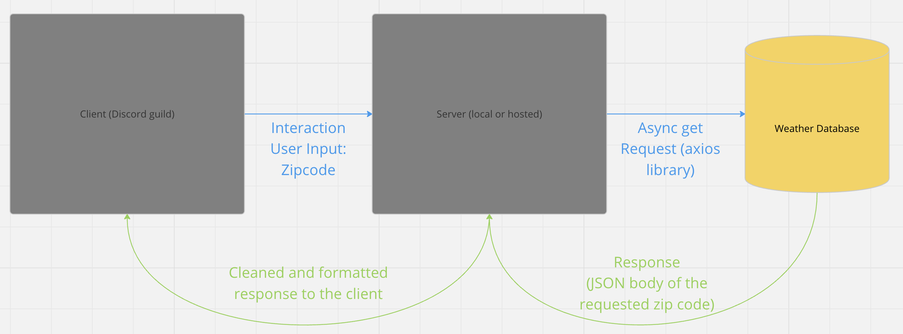

# DXA-takehome

## Overview

This project is a bot that will show the current forecast based on user input zip code

## Install

Install dependencies:

```
  npm install
```

Run server:

```
  npm start 
```

## Data ERD



## Usage

Project is not currently deployed.
