# Process Documentation

**Requirements:**

* IDE (I used Visual Studio Code)
* Node.js v16 or newer
* WeatherAPI key (<weatherapi.com>)
* Discord Developer Portal Account
* Ability to take to bake a cake (optional)

## Setting up Bot

1. On your Discord Developer Account
    * Go to <https://discord.com/developers/applications>
    * Clink on "New Application" to create a application
    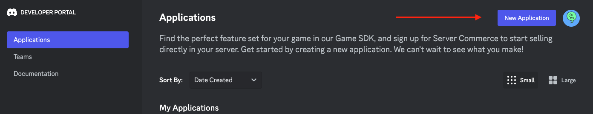
    * Give application a name and then click "Create"

2. Create a Bot for Application
    * Once app is create, move to the Bot tab on the left side. This is the menu where you can change the bots icon, name, generate a token, and privilege intents.
    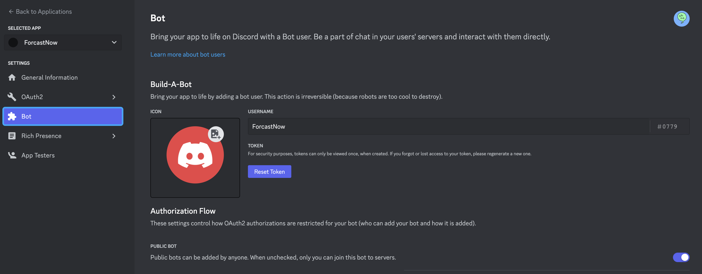
    * NOTE: Keep token secure and do not share

3. Invite Bot to server
    * In the app settings, move to the OAuth2 tab
    * Under scopes select bot and application.commands
    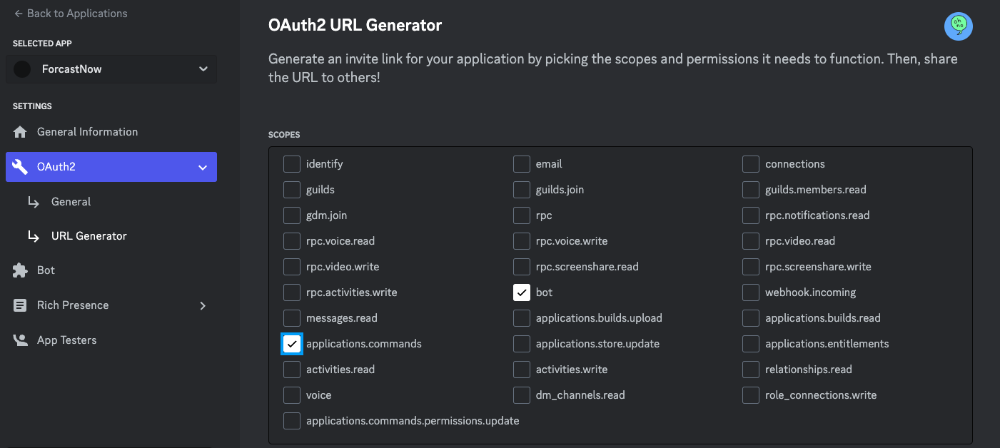
    * Select necessary bot permissions
    * Generate invite URL at bottom of page
    * Copy URL and paste it into the Discord server you want to invite and click link to accept invite
    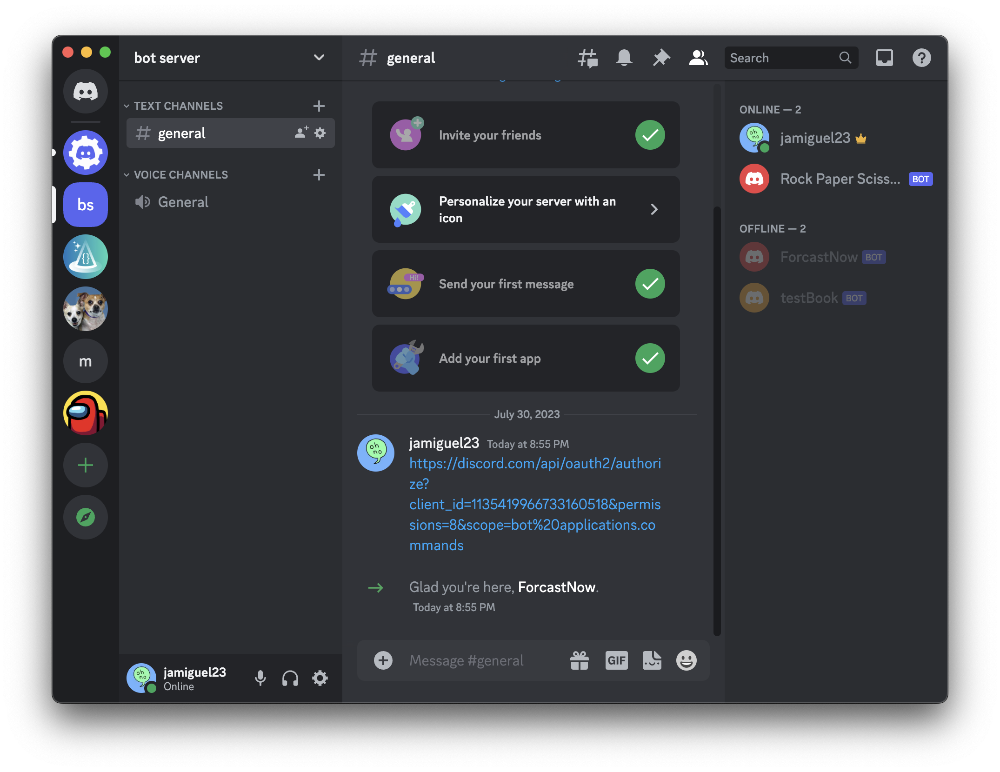

## Developing Bot

1. Using your IDE of your choice set up development environment
    * Initialize package manager like npm or yarn
    * Install dependencies like discord.js, axios, and dotenv
    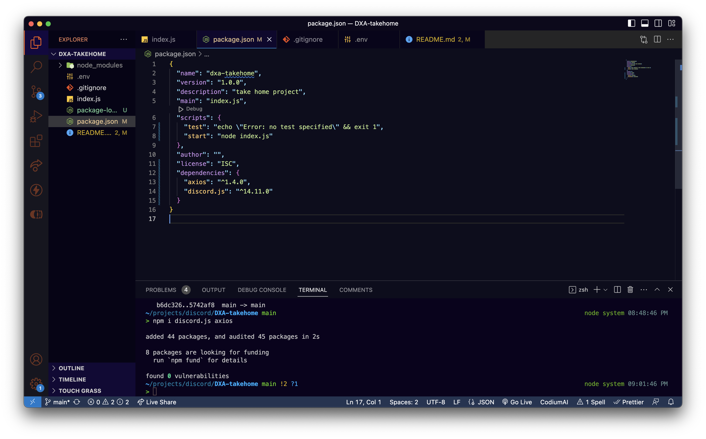
    * Create index.js file and make it entry point
    * Create .env file to require and config in index.js and then add bot token, guildID, clientID, and weatherAPI key to the .env file. Sample env in root
    * In the index.js file initialize client with proper intents, login using TOKEN, and add ready event listener.
    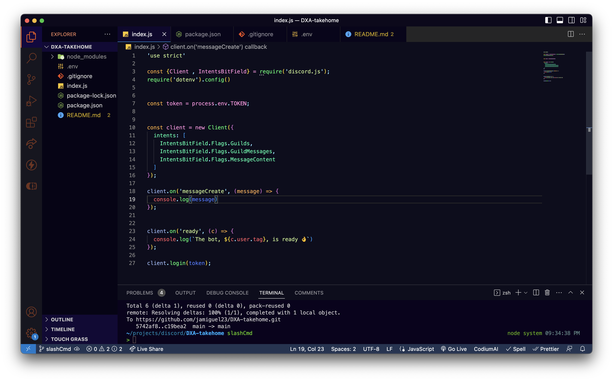

2. Create util functions to register and deploy commands

    * Create a new folder called commands that will hold all the slash commands. NOTE: This step will help with scalability
    * In the new command folder, add another new folder named the command you want to create
    * Inside that subfolder crete a .js file with the name of your command that exports data and the execute function
    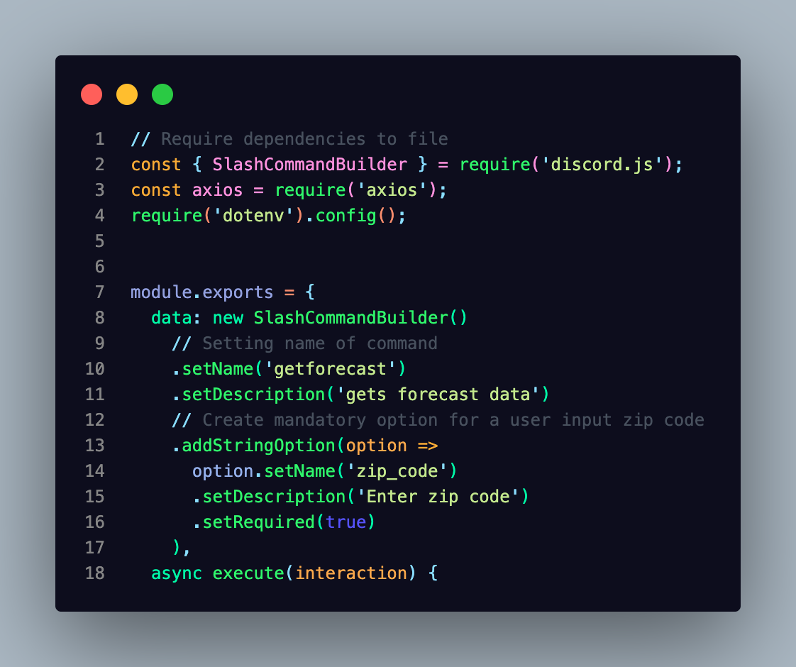
    * At the root of the file create a new file called deploy-command.js to deploy the functionality of the command
    * The following code was adapted from discordjs.guide and will use the fs and path modules from node.js to find the path of the commands, clean the data, store the list of commands, and use a put method deploy the commands
    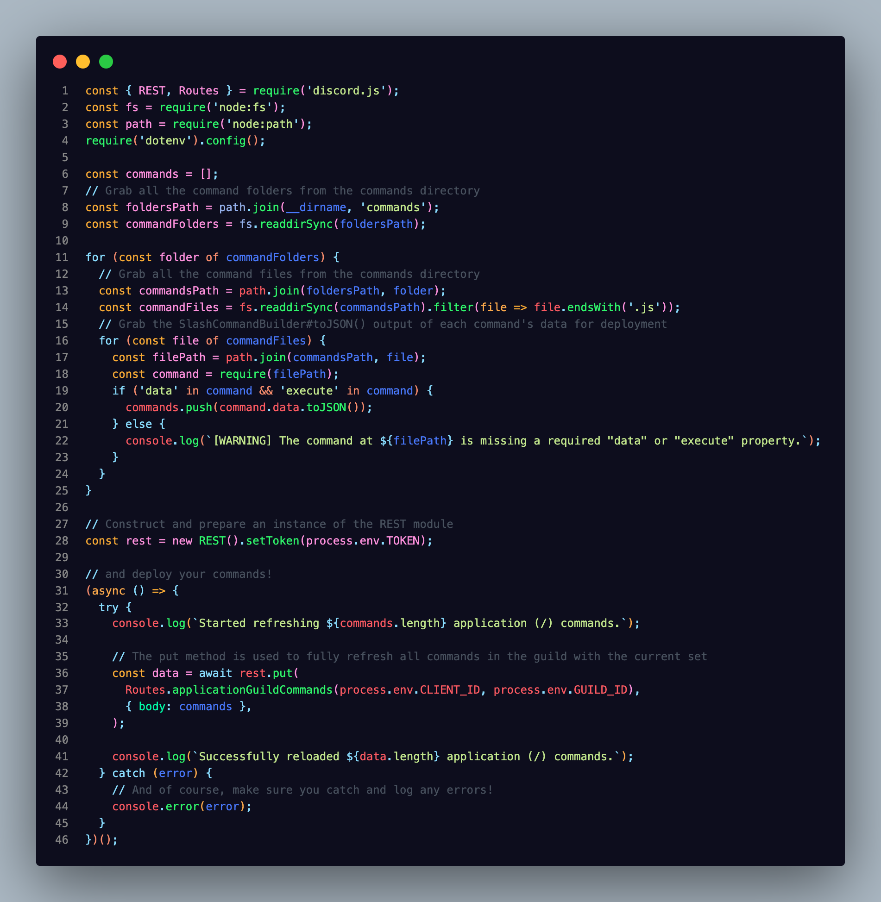
    * Run the delopy-commands file with the following in the terminal

    ```
        node depoly-command.js
    ```

    The terminal will echo with a message of completion or error
    * To register the commands the fs and path modules are also needed in the index.js file when the bot goes live
    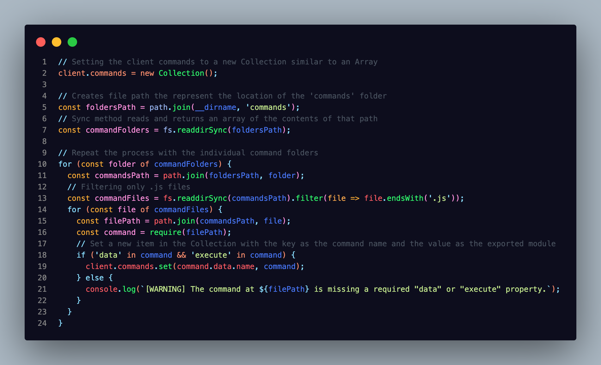

    * create event listener in the index page to listen for slash commands
    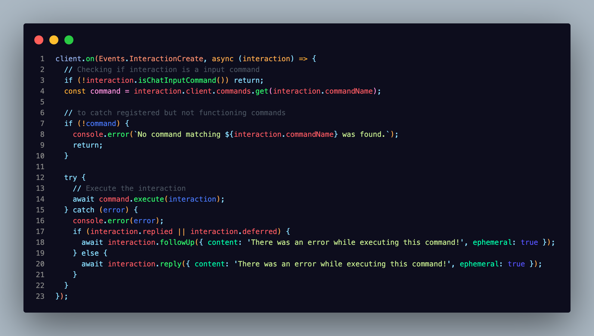

    * Start up your server using nodemon or the terminal command node index.js. The slash command will be visible to the Discord Server
    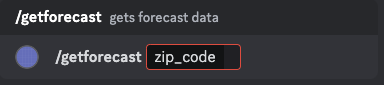

3. Weather Request
